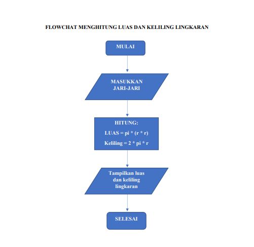
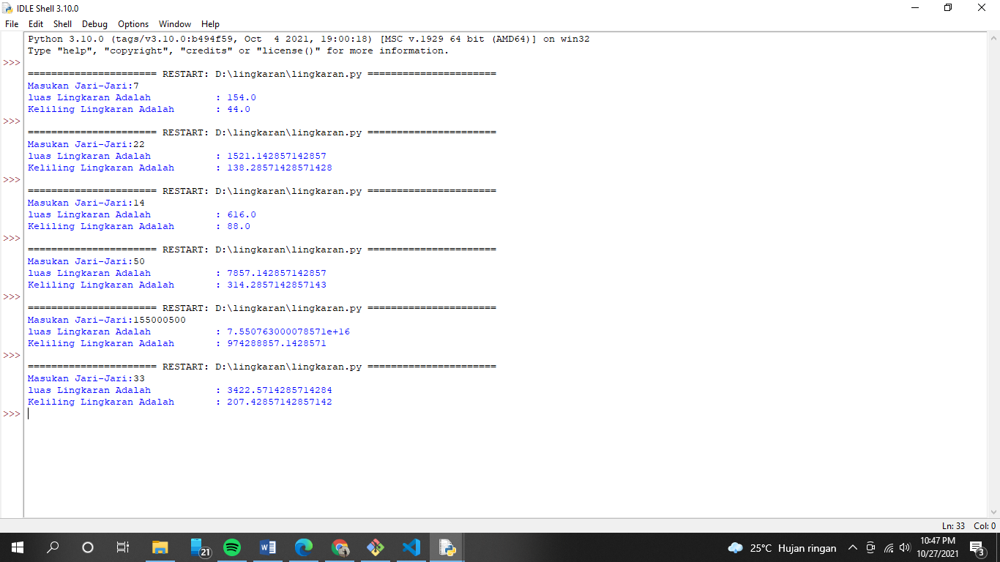

# Python
## Menghitung Luas dan Keliling Lingkaran Menggunakan Bahasa Python
### Oke pertama saya membuat flowchartnya terlebih dahulu, berikut tampilan gambarnya

### Berikut rumus luas dan keliling lingkaran

### dan nilai phi yang saya gunakan adalah 22/7
### Oke berikut adalah tampilan haasil dari program saya

- > phi = 22/7
### Nah phi yang di atas maksudnya adalah sebuah variabel konstanta yang ada di matematika
- > r= input("Masukan Jari-Jari:")
### "r" sendiri maksudnya adalah hanya sebuah variabel saja, untuk menyimpan data dari inputan
- > luas= phi*int(r)*int(r)
- > kel= 2*phi*int(r)   
### Sedangkan "luas dan kel" disini juga sama hannya sebuah variabel, tapi datanya sebuah oprator yang befungsi untuk perhitungan sebuah program
- > print("luas Lingkaran Adalah\t\t:",luas)
- > print("Keliling Lingkaran Adalah\t:",kel)
### setelah itu "print", nah disini dia akan mengeluarkan hasil dari inputan yang telah diisi, dengan memasukan variable yang di atas, maka otomatis inputan yang di input akan di hitung dan di keluarkan di sini
# Terimakasih, sekian dari saya